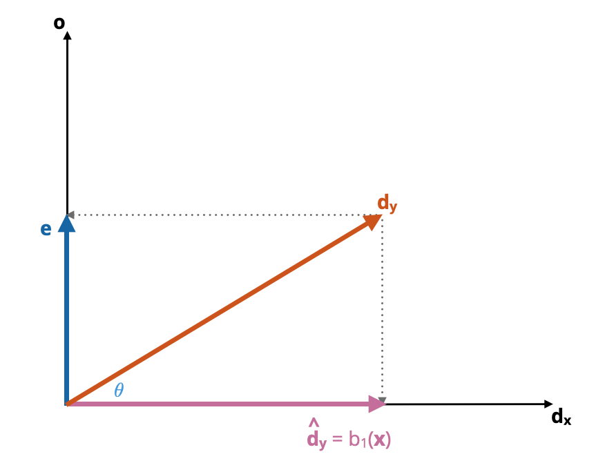
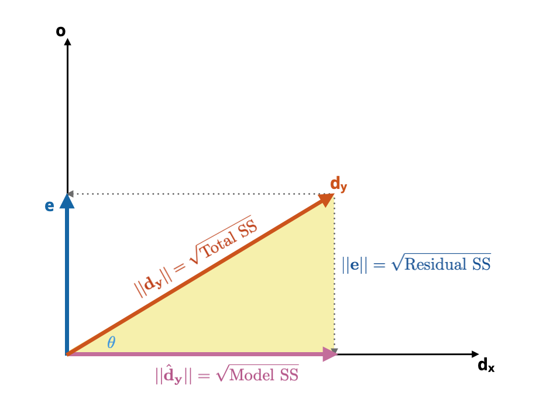
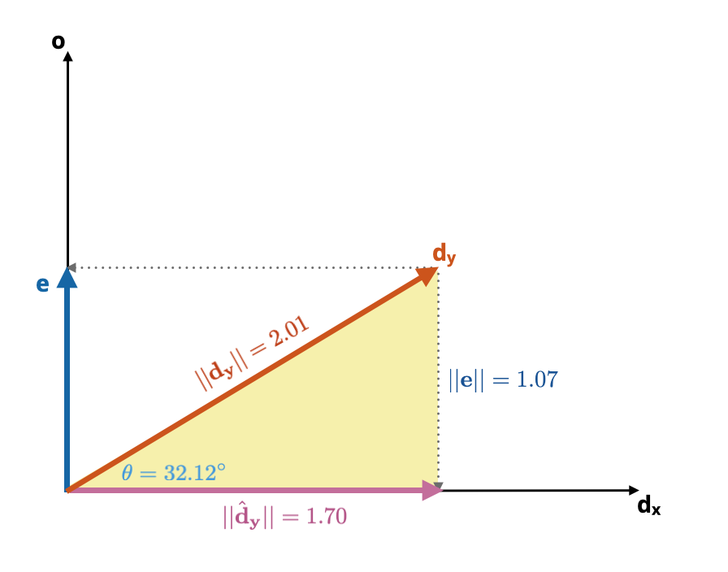

# Statistical Application: Vectors

In this chapter, we will provide examples of how vectors define the underlying geometry of various statistical summaries (standard deviation and correlation coefficient), including linear models. We will provide an example using a single predictor, but again, the ideas can be extended to models that include multiple predictors.


## Deviation Scores and the Standard Deviation

Consider the following vector scores (**x**) and the vector of the mean deviation scores ($\mathbf{d_x}$):

$$
\mathbf{x} = \begin{bmatrix} x_1 \\ x_2 \\ x_3 \\ \vdots \\ x_n\end{bmatrix} \qquad \mathbf{d_x} = \begin{bmatrix} x_1-\bar{x} \\ x_2-\bar{x} \\ x_3-\bar{x} \\ \vdots \\ x_n-\bar{x}\end{bmatrix}
$$

Remember that the length of a vector is the square root of the dot product of the vector with itself. If we were to compute the length of the deviation score vector, the length would be the square root of the sum of squared deviations:

$$
\sqrt{\mathbf{d_x}\bullet \mathbf{d_x}} = \sqrt{(x_1 - \bar{x})^2 + (x_2 - \bar{x})^2 + (x_3 - \bar{x})^2 + \ldots + (x_n - \bar{x})^2}
$$

If we divided this result by $\sqrt{n}$, this would be equivalent to the standard deviation of the scores in **x** ($s_\mathbf{x}$). 

$$
s_\mathbf{x} = \frac{\lvert\lvert\mathbf{d_x}\rvert\rvert}{\sqrt{n}}
$$

So there is a direct relation between the length of a deviation vector and the standard deviation, namely,

$$
\lvert\lvert\mathbf{d_x}\rvert\rvert = \sqrt{n} (s_\mathbf{x})
$$

Consider the following vectors of data representing SAT scores (**x**) and GPA values (**y**) for $n=10$ student:

$$
\mathbf{x} = \begin{bmatrix}760 \\ 710 \\ 680 \\ 730 \\ 420 \\ 410 \\ 620 \\ 630 \\ 720 \\ 670\end{bmatrix} \qquad \mathbf{y} = \begin{bmatrix} 3.8 \\ 2.4 \\ 2.6 \\ 3.1 \\ 1.9 \\ 1.7 \\ 2.5 \\ 2.4 \\ 3.5 \\ 3.1\end{bmatrix}
$$

We compute the mean scores for each vector as $\bar{x}=635$ and $\bar{y}=2.7$, respectively. By subtracting the mean (which is a scalar) from each vector of data, we can create deviation vectors:

$$
\mathbf{d_x} = \mathbf{x} - 635 = \begin{bmatrix}125 \\ 75 \\ 45 \\ 95 \\ -215 \\ -225 \\ -15 \\ -5 \\ 85 \\ 35\end{bmatrix} \qquad \mathbf{d_y} =\mathbf{y}-2.7 = \begin{bmatrix}1.1 \\ -0.3 \\ -0.1 \\ 0.4 \\ -0.8 \\ -1.0 \\ -0.2 \\ -0.3 \\ 0.8 \\ 0.4\end{bmatrix}
$$
The length of the deviation vectors are computed as $\sqrt{\mathbf{d}\bullet\mathbf{d}}$, namely,

$$
\begin{split}
\lvert\lvert\mathbf{d_x}\rvert\rvert &= \sqrt{\mathbf{d_x}\bullet\mathbf{d_x}} \\[2em]
\lvert\lvert\mathbf{d_x}\rvert\rvert &= \sqrt{\mathbf{d_y}\bullet\mathbf{d_y}}
\end{split}
$$

And using the values in the deviation vectors,

$$
\begin{split}
\lvert\lvert\mathbf{d_x}\rvert\rvert &= \sqrt{137850} = 371.28 \\[2em]
\lvert\lvert\mathbf{d_x}\rvert\rvert &= \sqrt{4.04} = 2.01
\end{split}
$$

Finally, we can compute the standard deviations for **x** and **y** by dividing these lengths by $\sqrt{n}$.

$$
\begin{split}
s_\mathbf{x} &= \frac{371.28}{\sqrt{10}} = 117.41 \\[2em]
s_\mathbf{y} &= \frac{4.04}{\sqrt{10}} = 0.64
\end{split}
$$


```{r}
# Original vectors
x = matrix(data = c(760, 710, 680, 730, 420, 410, 620, 630, 720, 670), ncol = 1)
y = matrix(data = c(3.8, 2.4, 2.6, 3.1, 1.9, 1.7, 2.5, 2.4, 3.5, 3.1), ncol = 1)

# Compute deviation vectors
d_x = x - mean(x)
d_x

d_y = y - mean(y)
d_y

# Compute lengths of x deviation vector
l_x = sqrt(sum(d_x * d_x))
l_x

# Compute lengths of y deviation vector
l_y = sqrt(sum(d_y * d_y))
l_y

# Compute sd of x
s_x = l_x / sqrt(10)
s_x

# Compute sd of y
s_y = l_y / sqrt(10)
s_y
```

Note that if we are using $s_\mathbf{x}$ as an estimate for the population parameter $\sigma_\mathbf{x}$, that is **x** is a sample of student scores, then we need to divide the length of vector **x** by $n-1$ rather than $n$. In that case,

$$
\begin{split}
\hat\sigma_\mathbf{x} &= \frac{371.28}{\sqrt{9}} = 123.76 \\[2em]
\hat\sigma_\mathbf{y} &= \frac{4.04}{\sqrt{9}} = 0.67
\end{split}
$$

This is the denominator that is used in the `sd()` function in R.

```{r}
# Compute sd of x
sigma_x = l_x / sqrt(9)
sigma_x

# Compute sd of y
sigma_y = l_y / sqrt(9)
sigma_y

# Check results
sd(x)
sd(y)
```


<br />


## Vector Correlation and Separation

The correlation between two vectors can also be expressed in terms of deviation scores:

$$
\begin{split}
r_{xy} &= \frac{\mathrm{Cov}_{\mathbf{xy}}}{s_\mathbf{x} s_\mathbf{y}} \\[2em]
&= \frac{\frac{\sum (\mathbf{x}-\bar{x})(\mathbf{y}-\bar{y})}{n}}{s_\mathbf{x} s_\mathbf{y}}
\end{split}
$$

The expression $\sum (x-\bar{x})(y-\bar{y})$ is equivalent to $\mathbf{x}\bullet\mathbf{y}$. Furthermore, we can re-write the standard deviations using our previous relationship with length of the deviation vectors. This implies,

$$
\begin{split}
r_{xy} &= \frac{\frac{\mathbf{d_x}\bullet\mathbf{d_y}}{n}}{\frac{\lvert\lvert\mathbf{d_x}\rvert\rvert}{\sqrt{n}}\frac{\lvert\lvert\mathbf{d_y}\rvert\rvert}{\sqrt{n}}} \\[2em]
&= \frac{\frac{\mathbf{d_x}\bullet\mathbf{d_y}}{n}}{\frac{\lvert\lvert\mathbf{d_x}\rvert\rvert~\lvert\lvert\mathbf{d_y}\rvert\rvert}{n}} \\[2em]
&= \frac{\mathbf{d_x}\bullet\mathbf{d_y}}{\lvert\lvert\mathbf{d_x}\rvert\rvert~\lvert\lvert\mathbf{d_y}\rvert\rvert}
\end{split}
$$
That is, the correlation between **x** and **y** is equal to the ratio between the dot product of the deviation vectors and the product of their lengths.^[Most formulas for the correlation will use $n-1$ rather than $n$, but here it doesn't matter as the $n$s drop out when we reduce this.] In our example,

```{r}
# Compute correlation
sum(d_x * d_y) / (l_x * l_y)

# Check with correlation function
cor(x, y)
```

Recall that the angle between two vectors **a** and **b**, denoted $\theta_{\mathbf{ab}}$, is given by,

$$
\cos (\theta_{\mathbf{ab}}) = \frac{\mathbf{a}\bullet\mathbf{b}}{\lvert\lvert\mathbf{a}\rvert\rvert\times\lvert\lvert\mathbf{b}\rvert\rvert}
$$

Thus to compute the angle between the two deviation vectors ($\theta$), this is:

$$
\cos (\theta) = \frac{\mathbf{d_x}\bullet\mathbf{d_y}}{\lvert\lvert\mathbf{d_x}\rvert\rvert\times\lvert\lvert\mathbf{d_y}\rvert\rvert}
$$

This is the same as the formula for the correlation! In other words,

$$
r_{\mathbf{xy}} = \cos (\theta)
$$

The correlation between two vectors **x** and **y** is equal to the cosine of the angle between their deviation vectors. Using this equality, we can find the angle between the deviation vectors for our example SAT scores and GPA values. Since $r_{\mathbf{xy}}=0.847$, that implies $\theta\approx32^\circ$.

```{r}
# Compute theta (in radians)
acos(0.847)

# Compute theta (in degrees)
acos(0.847) * 180 / pi
```

This correlation corresponds to an angle of approximately $32^\circ$ of separation between the deviation score vectors for SAT scores and GPA values in the 10-dimensional space defined by our 10 students.


:::fyi
We can use the fact that $r_{\mathbf{xy}} = \cos (\theta)$ to make some connections between the value of the correlation coefficient and the angle between the deviation vectors.

- Perfect positive correlation ($r_{\mathbf{xy}}=1$) indicates that deviation vectors are collinear. In this case $\cos(\theta)=1$ which implies that $\theta=0^\circ$.
- Perfect negative correlation ($r_{\mathbf{xy}}=-1$) indicates that deviation vectors are in opposite directions. In this case $\cos(\theta)=-1$ which implies that $\theta=180^\circ$.
- Perfect lack of correlation ($r_{\mathbf{xy}}=0$) indicates that deviation vectors are orthogonal. In this case $\cos(\theta)=0$ which implies that $\theta=90^\circ$.
:::

<br />


## Orthogonal Decomposition and Bivariate Regression

Recall that the simple regression model seeks to explain variation in an outcome variable *Y* using a predictor variable *X*. Mathematically, the model fitted is expressed as:

$$
\mathbf{y} = b_0 + b_1(\mathbf{x}) + \mathbf{e}
$$

where **y** is a vector of fitted values, $b_0$ and $b_1$ are scalars produced from the OLS estimation, **x** is a vector of the predictor values, and **e** is a vector of residuals. Recall that when we have mean centered the outcome and predictor, the intercept ($b_0$) drops out of this equation. we can express this as:

$$
\mathbf{y} - \bar{y} = b_1(\mathbf{x} - \bar{x}) + \mathbf{e}
$$

The outcome and predictors are now expressed as deviation vectors, say

$$
\mathbf{d}_\mathbf{y} = b_1(\mathbf{d}_\mathbf{x} ) + \mathbf{e}
$$
where $\hat{\mathbf{d}}_\mathbf{y}=b_1(\mathbf{d}_\mathbf{x} )$. That is, we can partition the deviation vector of **y** into two components:

$$
\mathbf{d}_\mathbf{y} = \hat{\mathbf{d}}_\mathbf{y} + \mathbf{e}
$$

Ordinary least squares (OLS) estimation determines the value of $b_1$ by minimizing the sum of squared residuals, that is, it minimizes the quantity $\lvert\lvert\mathbf{e}\rvert\rvert^2$. Geometrically, minimizing $\lvert\lvert\mathbf{e}\rvert\rvert^2$ is determining the orthogonal projection of $\mathbf{d}_\mathbf{y}$ onto $\mathbf{d}_\mathbf{x}$.^[Remember from geometry that the shortest distance from a point (at the end of the $\mathbf{d}_\mathbf{y}$) to a line (spanned by $\mathbf{d}_\mathbf{x}$) is the perpendicular line segment between them.] This projection is the first component of the partitioning of the deviation vector described previously, $\hat{\mathbf{d}}_\mathbf{y}=b_1(\mathbf{d}_\mathbf{x})$, which is collinear with $\mathbf{d}_\mathbf{x}$ since $b_1(\mathbf{d}_\mathbf{x})$ is a scalar multiple of $\mathbf{d}_\mathbf{x}$ This is shown in Figure \@ref(fig:fig06-01).

```{r fig06-01, echo=FALSE, out.width="60%", fig.cap="The two orthogonal projections from the deviation vector of **y** form the basis for the model triangle (yellow). Note that the vector making up the right side of the model triangle is the same as the **e** vector."}

```


The 'triangle' formed by the vectors $\hat{\mathbf{d}}_\mathbf{y}$, **e**, and $\mathbf{d}_\mathbf{y}$ is referred  to as the *model triangle*. Figure \@ref(fig:model-triangle) shows the model triangle. (Remember **e** can be moved to the right-side of the triangle since location is not a vector property.)

```{r model-triangle, echo=FALSE, out.width="60%", fig.cap="The model triangle (yellow). Note that the vector making up the right side of the model triangle is the same as the **e** vector."}
knitr::include_graphics("figs/fig-06-model-triangle.png")
```

The geometry of this triangle is the same as the geometry visualizing the sum of these vectors, namely 

$$
\mathbf{d}_\mathbf{y} = \hat{\mathbf{d}}_\mathbf{y} + \mathbf{e}
$$

Namely that the vectors that create the legs of the model triangle can be added together to create the $\mathbf{d}_\mathbf{y}$ hypotenuse vector. The **e** vector is also the second orthogonal projection vector, $\mathbf{e} = \mathbf{p}_{\mathbf{d}_\mathbf{y}\perp\mathbf{o}}$. By definition, this means that the vector of residuals (**e**) is orthogonal to the vector of fitted values ($\hat{\mathbf{d}}_\mathbf{y}$), which means, the correlation between those two vectors is zero.

$$
r_{\mathbf{e},\hat{\mathbf{d}}_\mathbf{y}} = 0
$$

It also means that the model triangle is a right triangle, whose side lengths are governed by the Pythagorean Theorem.

$$
\lvert\lvert\mathbf{d}_\mathbf{y}\rvert\rvert^2 = \lvert\lvert\hat{\mathbf{d}}_\mathbf{y}\rvert\rvert^2 + \lvert\lvert\mathbf{e}\rvert\rvert^2
$$

Expressing these lengths using the deviations we get

$$
\sum_{i=1}^n (y_i - \bar{y})^2 = \sum_{i=1}^n (\hat{y}_i - \bar{y})^2 + \sum_{i=1}^n (y_i - \hat{y}_i)^2
$$

This is the partitioning that describes the ANOVA decomposition:

$$
\mathrm{Total~SS} = \mathrm{Model~SS} + \mathrm{Residual~SS}
$$

Each of these sum of squares is the squared length of one of the vectors in the model triangle.

$$
\begin{split}
\mathrm{Total~SS} &= \lvert\lvert\mathbf{d}_\mathbf{y}\rvert\rvert^2 \\[2em]
\mathrm{Model~SS} &= \lvert\lvert\hat{\mathbf{d}}_\mathbf{y}\rvert\rvert^2 \\[2em]
\mathrm{Residual~SS} &= \lvert\lvert\mathbf{e}\rvert\rvert^2
\end{split}
$$

Relatedly, the lengths of the vectors making up the model triangle are the square roots of the these sum of square terms:

$$
\begin{split}
\lvert\lvert\mathbf{d}_\mathbf{y}\rvert\rvert &= \sqrt{\mathrm{Total~SS}} \\[2em]
\lvert\lvert\hat{\mathbf{d}}_\mathbf{y}\rvert\rvert &= \sqrt{\mathrm{Model~SS}} \\[2em]
\lvert\lvert\mathbf{e}\rvert\rvert &= \sqrt{\mathrm{Residual~SS}}
\end{split}
$$


```{r echo=FALSE, out.width="60%", fig.cap="The side lengths of the model triangle (yellow) correspond to the square roots of the sum of square terms used in the ANOVA decomposition."}

```


Lastly, since the model-level $R^2$ value is defined as $R^2 = \frac{\mathrm{Model~SS}}{\mathrm{Total~SS}}$ and there is only a single predictor in the model then,

$$
\begin{split}
r_{\mathbf{xy}} &= \sqrt{R^2} \\[2em]
&= \sqrt{\frac{\mathrm{Model~SS}}{\mathrm{Total~SS}}} \\[2em]
&= \frac{\sqrt{\mathrm{Model~SS}}}{\sqrt{\mathrm{Total~SS}}} \\[2em]
&= \frac{\lvert\lvert\hat{\mathbf{d}}_\mathbf{y}\rvert\rvert}{\lvert\lvert\mathbf{d}_\mathbf{y}\rvert\rvert}
\end{split}
$$

That is, the correlation coefficient between **x** and **y** is equivalent to the ratio of the lengths between the orthogonal projection vector collinear with the deviation vector of **x** and the deviation vector of **y**. Note this is also exactly how we compute cosine of $\theta$.

<br />


### Back to the SAT and GPA Example

Here we return to our GPA and SAT data to provide an example of these computations. Suppose we want to predict SAT (**y**) from GPA (**x**), employing deviation scores. We begin by computing the length of both deviation vectors:

$$
\begin{split}
\lvert\lvert\mathbf{d}_\mathbf{x}\rvert\rvert &= \sqrt{137850} = 371.28\\[2em]
\lvert\lvert\mathbf{d}_\mathbf{y}\rvert\rvert &= \sqrt{4.04} = 2.01
\end{split}
$$

```{r}
# Compute length of deviation vector d_x
sqrt(sum(l_x * l_x))

# Compute length of deviation vector d_y
sqrt(sum(l_y * l_y))
```

We can also compute the correlation coefficient between SAT scores and GPAs by finding the cosine of the angle between the two vectors, $r = 0.847$. Taking the arc-cosine, we find that $\theta = 32.12^\circ$.

```{r}
# Compute correlation
r = sum(d_x * d_y) / (l_x * l_y)
r
```

```{r echo=FALSE, out.width="60%", fig.cap="The model triangle (yellow) for our regression of GPA (**y**) onto SAT scores (**x**)."}

```

We can now use the definition of cosine and sine to compute the lengths of the two orthogonal projections from $\mathbf{d}_\mathbf{y}$. The length of the projection onto $\mathbf{d}_\mathbf{x}$ is calculated as:

$$
\begin{split}
\cos(\theta) &= \frac{\lvert\lvert\hat{\mathbf{d}}_\mathbf{y}\rvert\rvert}{\lvert\lvert\mathbf{d}_\mathbf{y}\rvert\rvert} \\[2em]
0.847 &= \frac{\lvert\lvert\hat{\mathbf{d}}_\mathbf{y}\rvert\rvert}{2.01} \\[2em]
\lvert\lvert\hat{\mathbf{d}}_\mathbf{y}\rvert\rvert &= 1.70
\end{split}
$$

The length of the second projection onto **o** is calculated as:

$$
\begin{split}
\sin(\theta) &= \frac{\lvert\lvert\mathbf{e}\rvert\rvert}{\lvert\lvert\mathbf{d}_\mathbf{y}\rvert\rvert} \\[2em]
0.531 &= \frac{\lvert\lvert\mathbf{e}\rvert\rvert}{2.01} \\[2em]
\lvert\lvert\mathbf{e}\rvert\rvert &= 1.07
\end{split}
$$


```{r}
# Compute length of projection on d_x
r * l_y

# Compute length of projection on o
sin(acos(r)) * l_y
```

Figure \@ref(fig:fig06-04) shows the model triangle for the regression of GPA (**y**) onto SAT scores (**x**) with all of the computed side lengths.

```{r fig06-04, echo=FALSE, out.width="60%", fig.cap="The model triangle (yellow) for our regression of GPA (**y**) onto SAT scores (**x**)."}

```


Finally, we can use these lengths, along with the length of $\mathbf{d}_\mathbf{y}$ to write out the ANOVA decomposition; the partitioning of the sum of squares.

$$
\begin{split}
\mathrm{Total~SS} &= \lvert\lvert\mathbf{d}_\mathbf{y}\rvert\rvert^2 = 2.01^2 = 4.04\\[2em]
\mathrm{Model~SS} &= \lvert\lvert\hat{\mathbf{d}}_\mathbf{y}\rvert\rvert^2 = 1.70^2 = 2.90\\[2em]
\mathrm{Residual~SS} &= \lvert\lvert\mathbf{e}\rvert\rvert^2 = 1.07^2 = 1.14
\end{split}
$$

These sums of squares are additive within rounding:

$$
\begin{split}
\mathrm{Total~SS} &= \mathrm{Model~SS} + \mathrm{Residual~SS} \\[2em]
4.04 &= 2.90 + 1.14
\end{split}
$$


Using these values we can also compute the model-level $R^2$.

$$
R^2 = \frac{\mathrm{Model~SS}}{\mathrm{Total~SS}} =  \frac{2.90}{4.04} = 0.718
$$

That is, differences in SAT scores explain 71.8% of the variation in GPAs.


<br />

