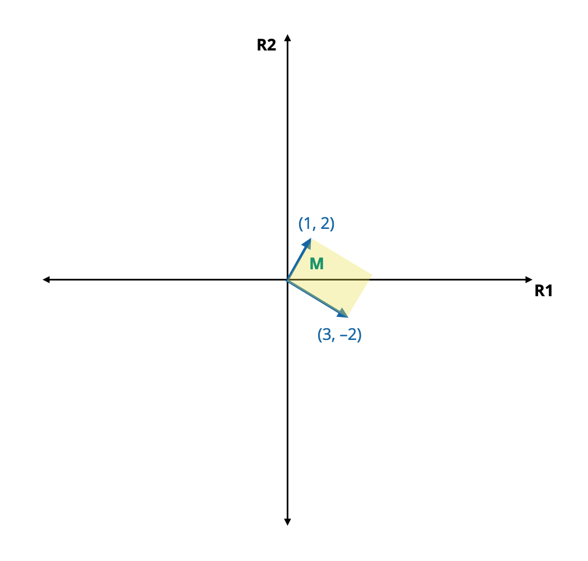

# Matrices

A matrix is a rectangular array of elements arranged in rows and columns. We typically denote matrices using a bold-faced, upper-case letter. For example, consider the matrix **B** which has 3 rows and 2 columns:


$$
\mathbf{B} = \begin{bmatrix}
5 & 1 \\
7 & 3 \\
-2 & -1
\end{bmatrix}
$$

In psychometric and statistical applications, the data we work with typically have this type of rectangular arrangement. For example, the data in \@ref(tab:tab01), which includes measures of 5 variables for 100 students, is arranged into the familiar case-by-variable rectangular 'data matrix'.^[In computation, a *matrix* is a very particular type of data structure in which every column has the same type of data (e.g., every column is numeric, or every column is a character variable). A *data frame* is a more generalized computational structure that accommodates multiple types of columns (variables).]

```{r tab01, echo=FALSE}
d = data.frame(
  ID = c("1", "2", "3", "$\\vdots$", "100"),
  SAT = c("560", "780", "620", "$\\vdots$", "600"),
  GPA = c("3.0", "3.9", "2.9", "$\\vdots$", "2.7"),
  IQ = c("112", "143", "124", "$\\vdots$", "129"),
  School = c("Public", "Public", "Private", "$\\vdots$", "Public")
)

knitr::kable(
  d, 
  #col.names = c("ID", "SAT", "GPA", "Self-Esteem", "IQ"),
  caption = "Example set of education data. The data are rectangular, having rows (cases) and columns (variables).",
  align = "c",
  table.attr = "style='width:60%;'",
  escape = FALSE
  )  %>%
  kable_classic()
```

<br />

### Dimensions of a Matrix

We define matrices in terms of their *dimensions* or *order*; the number of rows and columns within the matrix. The dimensions of the matrix **B** is $3\times 2$; it has three rows and two columns. Whereas the dimensions of the data matrix is $100\times 5$. We often denote the matrix's dimension by appending it to the bottom of the matrix's name,

$$
\underset{3\times 2}{\mathbf{B}} = \begin{bmatrix}
5 & 1 \\
7 & 3 \\
-2 & -1
\end{bmatrix}
$$ 

<br />

### Indexing Individual Elements

The elements within the matrix are indexed by their row number and column number. For example, $\mathbf{B}_{1,2} = 1$ since the element in the first row and second column is 1. The subscripts on each element indicate the row and column positions of the element.

Vectors are a special case of a matrix, where a row vector is a $1\times n$ matrix, and a column vector is a $n \times 1$ matrix. Note that although a vector can always be described as a matrix, a matrix cannot always be described as a vector.

In general, we define matrix **A**, which has *n* rows and *k* columns as:

$$
\underset{n\times k}{\mathbf{A}} = \begin{bmatrix}
a_{11} & a_{12} & a_{13} & \ldots & a_{1k} \\ 
a_{21} & a_{22} & a_{23} & \ldots & a_{2k} \\
a_{31} & a_{32} & a_{33} & \ldots & a_{3k} \\
\vdots & \vdots & \vdots & \vdots & \vdots \\
a_{n1} & a_{n2} & a_{n3} & \ldots & a_{nk}
\end{bmatrix}
$$

where element $a_{ij}$ is in the $i^{\mathrm{th}}$ row and $j^{\mathrm{th}}$ column of **A**.

<br />


### Geometry of Matrices

A matrix is an *k*-dimensional representation where *k* is the number of columns in the matrix. For example, consider the matrix **M**:

$$
\mathbf{M} = \begin{bmatrix}
1 & 3 \\ 2 & -2
\end{bmatrix}
$$

Since **M** has two columns, this matrix represents a 2-dimensional structure (i.e., a plane). Each column in the matrix corresponds to a vector in the coordinate system that helps define that structure. **M** is defined by the space encompassed by the vectors $(1, 2)$ and $(3, -2)$. Figure \@ref(fig:fig-07-01) shows matrix **M** plotted in the 2-dimensional coordinate space defined by R1 and R2.

```{r fig-07-01, echo=FALSE, out.width="60%", fig.cap="Matrix **M** (yellow) in the 2-dimensional coordinate system defined by R1 and R2."}

```

Because most matrices have much higher dimensions, we typically do not visualize them geometrically. 

<br />

### Matrices in R

To enter a matrix in R, we use the `matrix()` function, similar to creating a vector. The only difference is that the `nrow=` or `ncol=` argument will include a value other than 1. The elements of the matrix given in the `data=` argument, by default, will be filled-in by columns. For example to create matrix **B** from the earlier example, we can use the following syntax.

```{r}
# Create B by filling in columns
B = matrix(
  data = c(5, 7, -2, 1, 3, -1),
  nrow = 3,
  ncol = 2
  )

# Display B
B
```


The `byrow=TRUE` argument will fill the elements by rows rather than columns.

```{r}
# Create B by filling in rows
B = matrix(
  data = c(5, 1, 7, 3, -2, -1),
  byrow = TRUE,
  nrow = 3
  )

# Display B
B
```

The `dim()` function can be used to return the dimensions of a matrix.

```{r}
# Get matrix dimensions
dim(B)
```

Lastly, we can index elements of a matrix by specifying the row and column number of the matrix object for the element we want in square brackets. These values are separated by a comma. For example, to index the element in **B** that is in the 2nd row and 1st column, we use the following syntax:

```{r}
# Index the element in the 2nd row, 1st column
B[2, 1]
```


<br />

## Matrix Equality

Two matrices are said to be equal if they satisfy two conditions:

1. They have the same dimensions, and 
2. All corresponding elements are equal.

Consider the following matrices:

$$
\mathbf{A} = \begin{bmatrix}
112 & 86 & 0 \\ 134 & 94 & 0
\end{bmatrix} \qquad 
\mathbf{B} = \begin{bmatrix}
112 & 134 \\86 & 94 \\ 0 & 0
\end{bmatrix} \qquad 
\mathbf{C} = \begin{bmatrix}
112 & 86 & 0 \\ 134 & 94 & 0
\end{bmatrix}
$$

Within this set of matrices,

- $\mathbf{A} \neq \mathbf{B}$, since they do not have the same dimensions. **A** is a $2\times3$ matrix and **B** is a $3\times2$ matrix.
- Similarly, $\mathbf{A} \neq \mathbf{B}$, they also do not have the same dimensions.
- $\mathbf{A} = \mathbf{C}$ since both matrices have the same dimensions and all corresponding elements are equal.

<br />


## Transposition

Transposition is an operation that can also be carried out on matrices. Just as when we transpose a vector, we transpose a matrix by taking each column in turn and making it a row. In other words, we interchange each column and row, so the first column becomes the first row, the second column becomes the second row, etc.


similar to vectors, ne important vector operation is *transposition*. Transposition is an operation in which we replace the *i*th element of a column vector as the *i*th element of a row vector, and vice-versa. In other words, we are converting a column vector into a row vector, or, conversely, converting a row vector into a column vector. For example,

$$
\mathbf{A} = \begin{bmatrix}
112 & 86 & 0 \\ 134 & 94 & 0
\end{bmatrix} \qquad 
\mathbf{A}^\intercal = \begin{bmatrix}
112 & 134 \\86 & 94 \\ 0 & 0
\end{bmatrix}
$$

The `t()` function will produce the transpose of a matrix.

```{r}
# Create A
A = matrix(
  data = c(112, 134, 86, 94, 0, 0),
  nrow = 2
)

# Display A
A

# Compute transpose
t(A)
```

<br />


## Square Matrices

When the number of rows and columns are equal ($n=k$), the matrix is referred to as a *square matrix*. For example, **X** and **Y** are both square matrices.

$$
\underset{2\times 2}{\mathbf{X}} = \begin{bmatrix}
4 & 1 \\ 
0 & 3
\end{bmatrix} \qquad \underset{3\times 3}{\mathbf{Y}} = \begin{bmatrix}
0 & 1 & 0 \\ 
1 & 3 & -8\\
10 & 4 & -2
\end{bmatrix}
$$


### Major Diagonal

In a square matrix, the *major* (or *principle*) diagonal includes the elements that lie along the diagonal from the upper-left element to the lower-right element. For example, the major diagonal in **Y** (highlighted in red) includes the elements $0$, $3$, and $-2$. Elements not in the major diagonal are referred to as *off-diagonal elements*.

$$
\underset{3\times 3}{\mathbf{Y}} = \begin{bmatrix}
\color{red}0 & 1 & 0 \\ 
1 & \color{red}3 & -8\\
10 & 4 & \color{red}{-2}
\end{bmatrix}
$$

One interesting and useful property of a square matrix is that if we compute its transpose, the major diagonal is the same as in the original matrix.

$$
\underset{3\times 3}{\mathbf{Y}} = \begin{bmatrix}
\color{red}0 & 1 & 0 \\ 
1 & \color{red}3 & -8\\
10 & 4 & \color{red}{-2}
\end{bmatrix} \qquad
\underset{3\times 3}{\mathbf{Y}^\intercal} = \begin{bmatrix}
\color{red}0 & 1 & 10 \\ 
1 & \color{red}3 & 4\\
0 & -8 & \color{red}{-2}
\end{bmatrix}
$$


#### Find the Major Diagonal Using R

We can use the `diag()` function to return the elements on the main diagonal in a square matrix.

```{r}
# Create Y
Y = matrix(
  data = c(0, 1, 10, 1, 3, 4, 0, -8, -2),
  nrow = 3
  )

# Display Y
Y

# Find diagonal elements
diag(Y)
```

`r emo::ji("construction")` CAUTION: The `diag()` function also works on non-square matrices. However, it returns the elements on the diagonal starting with the element in the first row and column.

```{r}
# Create X
X = matrix(
  data = c(0, 1, 1, 3, 4, 0),
  nrow = 3
  )

# Display X
X

# Find 'diagonal' elements
diag(X)
```


<br />


### Matrix Trace

The *trace* of a square matrix is the sum of its diagonal elements. For example, consider the matrix **Y**:  

$$
\underset{3\times 3}{\mathbf{Y}} = \begin{bmatrix}
\color{red}0 & 1 & 0 \\ 
1 & \color{red}3 & -8\\
10 & 4 & \color{red}{-2}
\end{bmatrix}
$$

The trace of **Y** is $0 + 3 + -2 = 1$.

<br />

#### Computing the Trace in R

To compute the trace we use the `sum()` and `diag()` functions.

```{r}
# Compute trace of Y
sum(diag(Y))
```

You can also use the `tr()` function from the **psych** library to compute the trace.

```{r message=FALSE}
library(psych)
tr(Y)
```


<br />

## Symmetric Matrices

If $\mathbf{A} = \mathbf{A}^{\intercal}$, the matrix **A** is considered *symmetric*. For example, the following matrix **R** is symmetric:

$$
\underset{3\times 3}{\mathbf{R}} = \begin{bmatrix}
1.00 & 0.32 & 0.69\\
0.32 & 1.00 & 0.85 \\
0.69 & 0.85 & 1.00
\end{bmatrix} =
\underset{3\times 3}{\mathbf{R}^\intercal} = \begin{bmatrix}
1.00 & 0.32 & 0.69\\
0.32 & 1.00 & 0.85 \\
0.69 & 0.85 & 1.00
\end{bmatrix}
$$

In general, a matrix **A** is symmetric if,

$$
\mathbf{A}_{ij} = \mathbf{A}_{ji}
$$


If matrix **A** is symmetric, it necessitates that:

- $\mathbf{A}$ and $\mathbf{A}^{\intercal}$ have the same dimensions. This also implies that the matrix must be a  square matrix.
- All of the corresponding elements in $\mathbf{A}$ and $\mathbf{A}^{\intercal}$ are equal.

In statistical practice, variance--covariance matrices and correlation matrices are symmetric. Computationally, we can examine whether a matrix is symmetric by checking whether the logical statement equating a matrix and its transpose evaluates as `TRUE` for all elements.

```{r}
# Create matrix R
R = matrix(
  data = c(1.00, 0.32, 0.69, 0.32, 1.00, 0.85, 0.69, 0.85, 1.00),
  nrow = 3
)

# Display R
R

# Test for symmetry
R == t(R)
```

If this logical statement evaluates as `TRUE` for all the elements the matrix is symmetric. If the logical expression returns an *non-conformable array* error, or evaluates as `FALSE` for any of the elements, then it is not symmetric.

<br />

## Diagonal Matrices

A diagonal matrix is a square matrix in which all the off-diagonal elements are zero. Two examples of diagonal matrices are as follows:

$$
\underset{2\times 2}{\mathbf{D}_1} = \begin{bmatrix}
5 & 0 \\
0 & -1
\end{bmatrix} \qquad \underset{3\times 3}{\mathbf{D}_2} = \begin{bmatrix}
3 & 0 & 0 \\
0 & 3 & 0 \\
0 & 0 & 3
\end{bmatrix}
$$

In general, **D** is a diagonal matrix if $D_{ij}=0$ for all $i\neq j$.

<br />

## Scalar Matrices

A diagonal matrix in which all the diagonal elements have the same value is called a scalar matrix. The following two matrices are scalar matrices:

$$
\underset{2\times 2}{\mathbf{S}_1} = \begin{bmatrix}
-3 & 0 \\
0 & -3
\end{bmatrix} \qquad \underset{3\times 3}{\mathbf{S}_2} = \begin{bmatrix}
10 & 0 & 0 \\
0 & 10 & 0 \\
0 & 0 & 10
\end{bmatrix}
$$

Note that scalar matrices are symmetric. In general **S** is a scalar matrix if 

$$
\mathbf{S}_{ij}=\begin{cases}k \quad \mathrm{when} \quad i=j \\0 \quad \mathrm{when} \quad i\neq j\end{cases}
$$

<br />

### Identity Matrix

A special scalar matrix, the identity matrix, is one in which all the diagonal elements are the value of one (1).  

$$
\underset{2\times 2}{\mathbf{I}_1} = \begin{bmatrix}
1 & 0 \\
0 & 1
\end{bmatrix} \qquad \underset{3\times 3}{\mathbf{I}_2} = \begin{bmatrix}
1 & 0 & 0 \\
0 & 1 & 0 \\
0 & 0 & 1
\end{bmatrix}
$$

Note that all identity matrices are symmetric. The `diag()` function can be used to create an identity matrix. We give this function an argument which provides the number of rows and columns.

```{r}
# Create a 3x3 identity matrix
I = diag(3)

# Display I
I
```

<br />


